<div align="center">


**병원 간 HL7 v2 ADT 연동 브리지 — 레거시가 실제로 만들어지는 방식 그대로.**

Apache Ant · Spring XML · ActiveMQ Classic · WAS 없이 `main()` 하나로

[](#기술-스택)
[-5C8A56?style=flat-square)](#기술-스택)
[](#기술-스택)
[](#기술-스택)
[](#테스트)

[English](README.md) · **한국어**

</div>

---

## 목차

1. [왜 만들었나](#왜-만들었나)
2. [아키텍처](#아키텍처)
3. [메시지 한 건의 흐름](#메시지-한-건의-흐름)
4. [주요 동작 화면](#주요-동작-화면)
5. [기술 스택](#기술-스택)
6. [빠른 시작](#빠른-시작)
7. [프로젝트 구조](#프로젝트-구조)
8. [설계 결정](#설계-결정)
9. [이 PoC 가 실제로 잡아낸 문제들](#이-poc-가-실제로-잡아낸-문제들)
10. [테스트](#테스트)
11. [condb-secure 와의 대응](#condb-secure-와의-대응)
12. [문서](#문서)

---

## 왜 만들었나

회사에서 `condb-secure` 라는 레거시 모듈을 분석하고 있다. Apache Ant 빌드, Spring XML
설정, WAS 없이 `main()` 에서 `ClassPathXmlApplicationContext` 로 뜨고, ActiveMQ 큐를
소비해 암복호화하고 DB 에 적재한 뒤 외부 SOAP 를 호출하고 응답을 발행한다.

코드를 읽으면 **구조**는 보인다. 그런데 **왜 그렇게 했는지**는 보이지 않는다. 그래서 같은
아키텍처를 내가 모르는 도메인 — **병원 HL7 v2 연동** — 에 옮겨 놓고, 모든 결정을 의도적으로
내려 봤다.

제약은 일부러 걸었다. **Spring Boot 금지, 어노테이션 중심 설정 금지, auto-configuration
금지.** Boot 가 감춰 주는 것을 전부 손으로 쓴다. 감춰진 것을 보는 게 목적이기 때문이다.

> ⚠️ **이 저장소의 모든 환자 정보는 가상의 합성 데이터다.** 샘플·테스트·문서·로그 어디에도
> 실제 환자 정보는 쓰이지 않았다.

---

## 아키텍처

병원 A 가 입퇴원(ADT) 이벤트를 HL7 v2 메시지로 보낸다. 브리지가 이를 받아 환자 식별정보를
암호화해 적재하고, 병원 B 로 SOAP 전달한 뒤, HL7 ACK 로 응답한다.

<div align="center">

</div>

프로세스는 3개, 각각 자기 `main()` 을 가진다.

| 프로세스 | 명령 | 역할 |
|---|---|---|
| **브리지** | `ant run-bridge` | 모듈 본체 — 리스너, 서비스, DAO |
| **병원 B (mock)** | `ant run-mock` | 브리지가 호출하는 JAX-WS 엔드포인트 |
| **병원 A (시뮬레이터)** | `ant run-simulator` | ADT 메시지를 큐에 발행 |

---

## 메시지 한 건의 흐름

<div align="center">

</div>

리스너의 유일한 책임은 **오류 분류**다. 재시도할 것인가, 격리하고 커밋할 것인가.

| 예외 | ACK | 재시도 | 처리 |
|---|---|---|---|
| `Hl7ParseException` | `AR` | ✗ | 격리 후 트랜잭션 **커밋** |
| `PermanentProcessingException` | `AE` | ✗ | 격리 후 트랜잭션 **커밋** |
| `TransientProcessingException` | *(없음)* | ✓ | **롤백** → 2s/4s/8s → DLQ |
| 그 밖의 `RuntimeException` | *(없음)* | ✓ | 롤백 — 버그일 가능성이 높으니 덮지 않는다 |

일시 오류에 ACK 를 보내지 않는 것은 의도다. 아직 아무것도 확정되지 않았는데 성급한 `AE` 는
송신 측에 "영구 실패"로 읽힌다.

---

## 주요 동작 화면

메시지 브리지라 ActiveMQ 콘솔 말고는 UI 가 없다. 아래는 **실제로 돌린 결과를 캡처한
것**이지 목업이 아니다. 손댄 것은 모든 줄에 똑같이 붙는 로거 접두부를 줄인 것뿐이다.

### 기동 — 세 프로세스가 각각 `main()` 으로

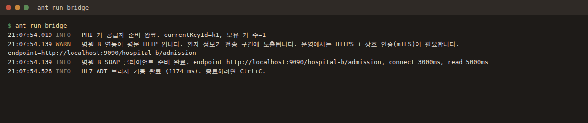

키 공급자 로그는 의도된 것이다. 키는 환경변수로 들어오고, 없으면 브리지가 기동을
거부한다. 평문 HTTP 경고는 이 PoC 가 mock 과 `http://` 로 통신하기 때문에 뜬다.

### 정상 흐름 — 입원, 그리고 퇴원

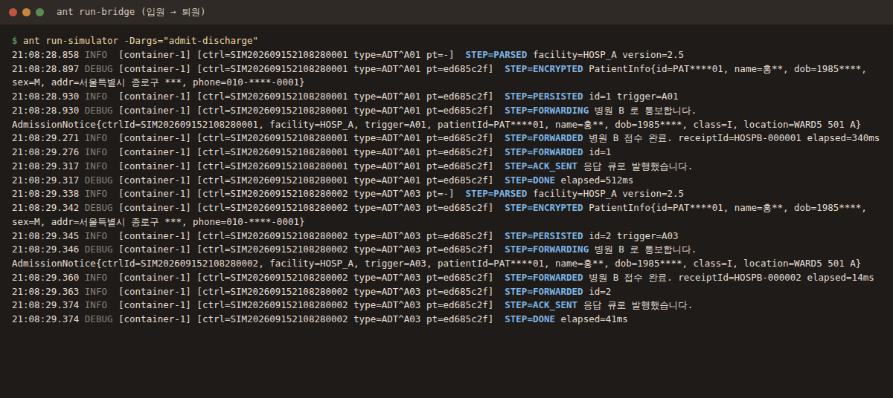

두 메시지가 **같은 컨슈머 스레드**(`container-1`)에서 순서대로 처리된다. `JMSXGroupID`
가 그 환자의 이벤트를 한 컨슈머에 고정한 결과다. 로그의 마스킹도 눈여겨볼 것:
`PatientInfo{id=PAT****01, name=홍**, dob=1985****}`.

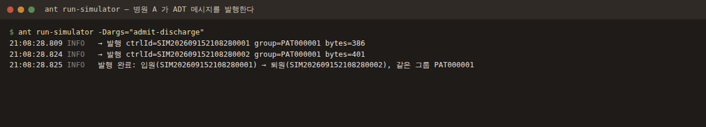

### 돌아오는 ACK

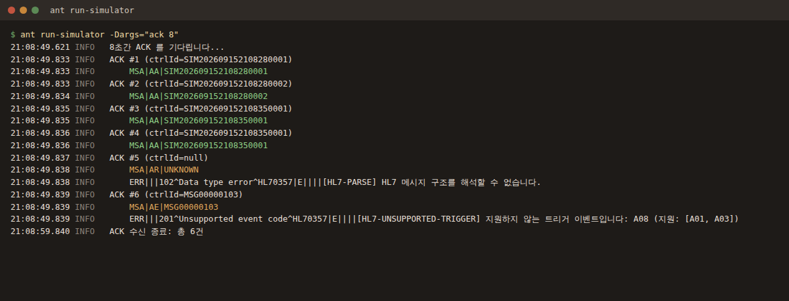

정상은 `AA`, 파싱 실패는 HL7 오류 코드 `102` 와 함께 `AR`, 미지원 트리거는 `201` 과 함께
`AE`. `ERR-8` 에는 우리 내부 코드가 담기되 **환자 정보는 없다** —
[문제 #5](#이-poc-가-실제로-잡아낸-문제들) 에서 고친 부분이다.

### 멱등성 — 같은 메시지를 두 번

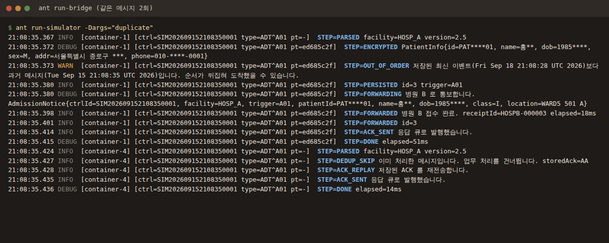

`DEDUP_SKIP` 다음 `ACK_REPLAY`. 두 번째 수신은 업무 로직을 통째로 건너뛰고 저장해 둔
ACK 를 재전송한다. 병원 B 에는 정확히 한 번만 통보된다.

### 병원 B 장애 — 재시도, 그리고 DLQ

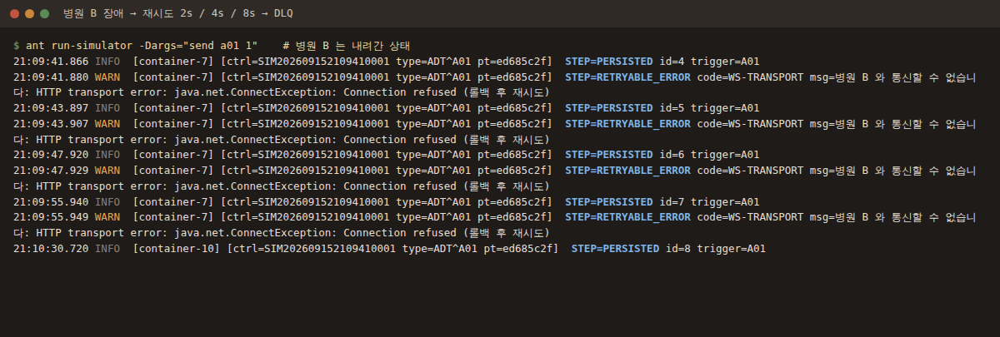

타임스탬프를 보자. `41.880 → 43.897 → 47.929 → 55.949`, 정확히 **2초·4초·8초**다.
지수 백오프가 실제로 동작한다. [문제 #1](#이-poc-가-실제로-잡아낸-문제들) 때는 바로 이
화면에서 네 번의 시도가 0.03초 간격으로 찍혔다. 각 시도마다 행이 들어갔다가
(`id=4,5,6,7`) 롤백된다.

### 복구 — DLQ 운영 도구

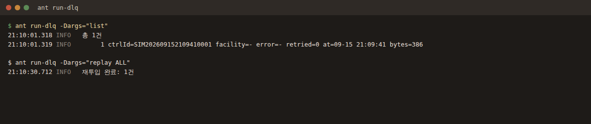

`list` 는 헤더만 출력한다. 본문은 환자 정보가 담긴 HL7 원문이라 절대 찍지 않는다.

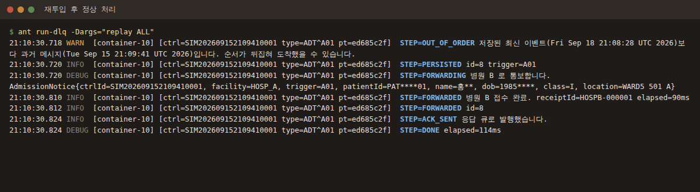

병원 B 가 복구된 뒤 재투입하면 그대로 통과한다. `STEP=OUT_OF_ORDER` 가 뜨는 이유는
재투입된 입원이 이미 저장된 퇴원보다 과거이기 때문이다. DB 방어선이 제 일을 하되
메시지를 버리지는 않는다.

### DB 는 이렇게 남는다

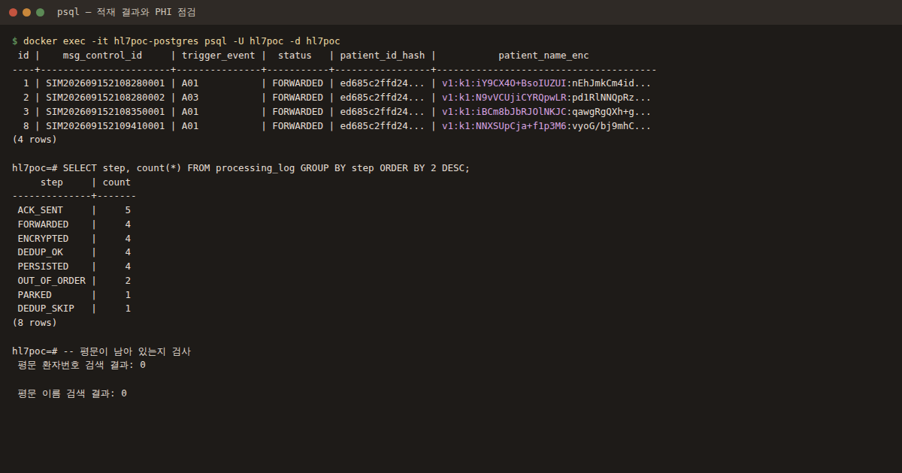

세 가지를 볼 것. 같은 환자는 늘 **같은 해시**(`ed685c2ffd24...`)라 행을 찾을 수 있다.
같은 이름인데도 `patient_name_enc` 는 **전부 다르다** — IV 가 매번 새로 생성되기
때문이다. 그리고 `id` 가 `3 → 8` 로 건너뛴다. 4~7 이 롤백된 재시도들이다. 평문 검색은
**0건**이다.

### ActiveMQ 콘솔

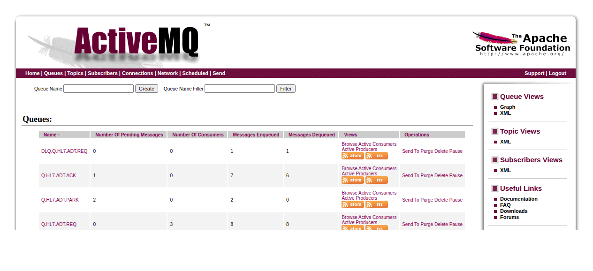

요청 큐에 컨슈머 3개, `concurrentConsumers=3` 과 일치한다. 격리 큐에는 영구 실패한
메시지가, DLQ 에는 재시도를 소진한 메시지가 남는다.

### 테스트

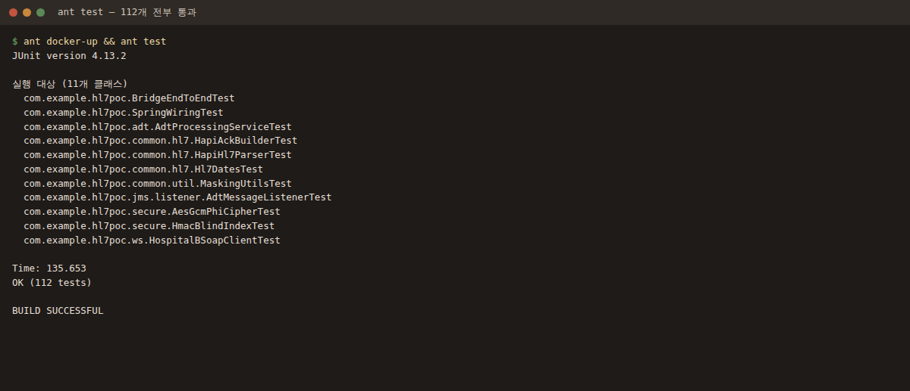

---

## 기술 스택

<div align="center">
<table>
<tr>
<td align="center" width="120"><br><sub>Java 11</sub></td>
<td align="center" width="120"><br><sub>Spring 5.3 (XML)</sub></td>
<td align="center" width="120"><br><sub>ActiveMQ Classic 5.18</sub></td>
<td align="center" width="120"><br><sub>PostgreSQL 15</sub></td>
</tr>
<tr>
<td align="center"><br><sub>HAPI HL7 v2.5</sub></td>
<td align="center"><br><sub>JAX-WS 2.3</sub></td>
<td align="center"><br><sub>Apache Ant + Ivy</sub></td>
<td align="center"><br><sub>Docker Compose</sub></td>
</tr>
</table>
<sub>로고는 공식 마크가 아니라 손으로 그린 대체 아이콘이다. <code>docs/images/generate.py</code> 가 생성한다.</sub>
</div>

버전 선택 중 임의가 아닌 것들:

- **ActiveMQ Classic 5.18** 은 `javax.jms` 네임스페이스를 쓰는 마지막 계열이다. 5.19+ 는
  `jakarta.jms` 로 넘어가 레거시 제약이 깨진다.
- **logback 1.2.x 가 아니라 1.3.x.** `activemq-client` 5.18 이 slf4j 2.0 기반이라 우리가
  뭘 선언하든 slf4j 가 올라간다. 그런데 slf4j 2.0 + logback 1.2 는 바인딩이 실패해
  **로그가 통째로 사라진다.** [문제 #2](#이-poc-가-실제로-잡아낸-문제들) 참고.
- **Ant 단독이 아니라 Ant + Ivy.** jar 44개를 손으로 관리하는 건 학습이 아니다.

---

## 빠른 시작

```bash
# 키는 바깥에서 주입한다. 없으면 브리지가 기동 자체를 거부한다.
export HL7POC_PHI_KEY="$(openssl rand -base64 32)"
export HL7POC_BLIND_INDEX_KEY="$(openssl rand -base64 32)"

ant docker-up      # ActiveMQ + PostgreSQL
ant resolve        # 의존성 (최초 1회, 약 1분)
ant dist           # 컴파일 + 빌드

# 터미널 2
ant run-mock       # 병원 B mock SOAP 서버 → :9090

# 터미널 3
ant run-bridge     # 브리지

# 터미널 4 — 메시지 보내기
ant run-simulator -Dargs="admit-discharge"
ant run-simulator -Dargs="ack 10"
```

ActiveMQ 콘솔: <http://localhost:8161/admin> (admin/admin) · PostgreSQL: `localhost:5432/hl7poc`

<details>
<summary><b>전체 Ant 타깃</b></summary>

| 타깃 | 설명 |
|---|---|
| `resolve` | 의존성을 `lib/` 로 (Ivy) |
| `compile` / `compile-test` | 컴파일 (`-Dskip.resolve=true` 로 해석 생략) |
| `dist` | `dist/*.jar` + `dist/lib/` |
| `test` | 테스트 (Docker 가 없으면 통합 테스트는 건너뜀) |
| `run-bridge` | ① 브리지 |
| `run-mock` | ② 병원 B mock SOAP 서버 |
| `run-simulator` | ③ 병원 A 시뮬레이터 — `-Dargs="send a01 3"` |
| `run-dlq` | DLQ 운영 도구 — `-Dargs="list"`, `-Dargs="replay ALL"` |
| `docker-up` / `docker-down` / `docker-reset` / `docker-logs` | 로컬 인프라 |
| `clean` / `distclean` | 산출물 / 의존성까지 삭제 |

</details>

<details>
<summary><b>시뮬레이터 시나리오</b></summary>

```bash
ant run-simulator -Dargs="send a01 3"      # 입원 3건, 매번 새 Control ID
ant run-simulator -Dargs="admit-discharge" # 같은 환자의 입원 → 퇴원
ant run-simulator -Dargs="duplicate"       # 같은 Control ID 두 번 (멱등성)
ant run-simulator -Dargs="burst 30"        # 환자 5명에 분산해 30건
ant run-simulator -Dargs="file adt_a01_broken_msh.hl7"   # 오류 케이스
ant run-simulator -Dargs="ack 15"          # 들어오는 ACK 출력
```

</details>

---

## 프로젝트 구조

```
com.example.hl7poc
├── Main.java                  main() + ClassPathXmlApplicationContext
├── common/   hl7/  파서, ACK 빌더, HL7 날짜 처리          ← HAPI 는 여기까지만
│             dto/  AdtEvent, PatientInfo (toString 은 항상 마스킹)
│             exception/  재시도 정책을 타입 계층에 박아 둔다
│             util/  마스킹, MDC 추적 컨텍스트
├── jms/      listener/ publisher/ dlq/ support/
├── adt/      service/ dao/ domain/
├── secure/   AES-256-GCM, HMAC 블라인드 인덱스, 키 공급자
├── ws/       SOAP 클라이언트 + mock 엔드포인트 + 공용 SEI
└── simulator/

src/main/resources/
├── spring/   app-context.xml + 기능별 8개
├── config/   hl7poc.properties   (모든 값이 ${ENV:기본값})
├── hl7-samples/   메시지 8종: 정상 3, 오류 5
└── wsdl/     hospital-b-admission.wsdl
```

---

## 설계 결정

<details open>
<summary><b>멱등성 — 선점은 트랜잭션 안에 있다</b></summary>

유니크 키는 MSH-10 단독이 아니라 `(sending_facility, msg_control_id)` 복합이다. Control ID
는 *송신 시스템 안에서만* 유일하므로, 단일 컬럼 키는 두 번째 병원이 붙는 순간 깨진다.

선점 행은 암호화·적재·SOAP 호출보다 **먼저** 넣는다. 중복을 처리하면 병원 B 에 같은 입원
통보가 두 번 가서 **상대 쪽 데이터가 깨지기** 때문이다.

결정적으로 선점은 **같은 트랜잭션 안**이다. SOAP 호출이 실패하면 선점도 함께 롤백되므로
재시도가 최초 수신으로 취급된다. 선점을 따로 커밋했다면 재시도가 "이미 처리됨"으로 판정되어
입원 기록이 조용히 사라진다 — 의료 연동에서 가장 나쁜 실패 모드다.

중복 판정은 `INSERT ... ON CONFLICT DO NOTHING` 의 영향 행 수로 한다. `SELECT` 후 `INSERT`
방식은 두 컨슈머가 동시에 "없음"을 볼 수 있다.
</details>

<details>
<summary><b>트랜잭션 — XA 대신 Best-Effort 1PC, DB 가 먼저</b></summary>

SOAP 은 트랜잭션 자원이 아니라서 XA 를 써도 실질적 원자성을 얻지 못한다. 리스너 컨테이너가
DB 트랜잭션을 열고, JMS 세션은 그 **뒤에** 커밋한다. 그 사이에 죽으면 메시지가 재전송되고
멱등성이 흡수한다. 순서가 반대면 메시지를 잃는다.

ACK 발행은 컨슈머의 JMS 세션이 아니라 **DB 트랜잭션에** 동기화된다
(`TransactionAwareConnectionFactoryProxy`). 롤백되면 ACK 도 함께 사라진다.
[자세히](docs/03-spring-xml.md)
</details>

<details>
<summary><b>동시성 — 메시지 그룹, 그리고 DB 방어선</b></summary>

`concurrentConsumers` 3 → 10, 환자별 `JMSXGroupID` 로 같은 환자의 이벤트를 한 컨슈머에
고정한다. 실측 결과: **컨슈머가 죽지 않아도 그룹은 재배정된다.** 3개에서 8개로 늘어나는
동안 환자 5명 중 3명의 그룹이 다른 스레드로 옮겨 갔다. 이번엔 순서가 지켜졌지만 "대체로
지켜진다"에 의료 데이터를 걸 수는 없어서, 서비스가 저장된 최신 이벤트보다 과거인 메시지를
따로 표시한다.
</details>

<details>
<summary><b>보안 — 키는 코드 밖에, 마스킹은 타입이 보장</b></summary>

암호문 형식은 `v1:{keyId}:{iv}:{ct}`. 버전이 없으면 전수 재암호화 없이는 알고리즘을 못
바꾸고, keyId 가 없으면 **키 회전이 곧 데이터 유실**이다. 접두부는 AAD 로 묶여 있어 keyId
바꿔치기가 탐지된다.

환자 ID 는 평문 SHA-256 이 아니라 **HMAC** 블라인드 인덱스를 쓴다. 환자번호는 값 공간이 좁아
전수 계산이 가능하다. 암호화와는 *다른* 키를 쓴다.

키가 없으면 첫 환자 메시지가 아니라 컨텍스트 로딩 때 실패한다. `PatientInfo.toString()` 은
무조건 마스킹한다. `log.info("환자={}", patient)` 한 줄이 유출의 전형적인 경로이기 때문이다.
</details>

<details>
<summary><b>관측성 — MSH-10 하나로 전 구간</b></summary>

```
2026-09-15 12:46:11.787 INFO [container-3] [ctrl=SIM...0001 type=ADT^A01 pt=35c8aac3]
  STEP=FORWARDED 병원 B 접수 완료. receiptId=HOSPB-000001 elapsed=348ms
```

`STEP=` 표식(`RECEIVED → PARSED → DEDUP_OK → ENCRYPTED → PERSISTED → FORWARDED →
ACK_SENT`)이 로그 파일과 `processing_log` 테이블 양쪽에 남는다. "이 메시지는 어디까지
갔나"를 SQL 한 줄로 답할 수 있다.
</details>

---

## 이 PoC 가 실제로 잡아낸 문제들

읽는 대신 만들어 본 이유다. 아래는 전부 추론이 아니라 **측정**으로 나왔다.

| # | 증상 | 원인 | 발견 경로 |
|---|---|---|---|
| 1 | 재시도 간격이 2s/4s/8s 가 아니라 **0.03초** | 외부 트랜잭션 매니저가 있으면 `DMLC` 가 `CACHE_NONE` 을 고르고, 그러면 수신마다 컨슈머를 버린다. 그런데 클라이언트측 재전송 지연은 *그 컨슈머를 쉬게 하는* 방식이다. 재시도 횟수와 DLQ 이동은 완벽히 정상으로 보였다. | 배달 시각 출력 ([#3.2](docs/03-spring-xml.md)) |
| 2 | 운영에서 로그가 **통째로 사라질 뻔** | `activemq-client` 5.18 이 slf4j 2.0 기반이라 1.7 선언이 무시된다. slf4j 2.0 + logback 1.2 는 바인딩이 실패해 no-op 로거로 떨어진다. 빌드도 실행도 정상이다. | 해석된 jar 확인 ([#4.2](docs/02-infrastructure.md)) |
| 3 | **본문이 빈 메시지**가 4회 재시도 후 DLQ 로 | 본문 추출이 파싱 실패 `catch` 범위 밖에 있었다. 빈 본문은 몇 번을 다시 보내도 빈 본문이다. | 단위 테스트 ([#2](docs/05-listener-service-dao-secure.md)) |
| 4 | 격리와 ACK 가 **삼켜지고** 메시지는 DLQ 로 | `PermanentProcessingException` 을 던지면 참여 중인 트랜잭션이 rollback-only 로 표시되어, 리스너의 격리·ACK 기록이 커밋 시점에 사라졌다. 명시적으로 *재시도하지 않는다*고 분류한 오류인데도. | 종단 간 테스트 ([#3](docs/07-ack-retry-dlq.md)) |
| 5 | 상대 병원으로 나가는 ACK 에 **환자 정보 유출** | 우리 예외는 원문을 담지 않는다. 그런데 HAPI 의 파싱 예외가 "참고용 앞 50자"를 붙이고, 그 문구가 `ERR-8` 로 중계됐다. | ACK 출력을 눈으로 확인 ([#4](docs/08-simulator-scenarios.md)) |

1번, 2번, 5번이 특히 고약하다. **다른 지표는 전부 정상으로 보였다.**

---

## 테스트

```bash
ant docker-up && ant test     # 112개
```

통합 테스트는 인프라가 없으면 스스로 건너뛰므로(`Assume`) Docker 없이도 `ant test` 는
통과한다.

| 스위트 | 개수 | 확인 대상 |
|---|---|---|
| `BridgeEndToEndTest` | 12 | `app-context.xml` 전체 + 실제 브로커·DB·SOAP |
| `HapiHl7ParserTest` | 11 | 파싱, 매핑, CR/LF/CRLF, MLLP 프레이밍, 오류 분류 |
| `HapiAckBuilderTest` | 15 | ACK 구조, 오류 코드 매핑, PHI 차단 |
| `AdtProcessingServiceTest` | 10 | 멱등성, 롤백, 블라인드 인덱스, 저장 시 PHI |
| `AesGcmPhiCipherTest` | 12 | 왕복, IV 유일성, 변조 탐지, 키 회전 |
| `AdtMessageListenerTest` | 11 | 실패 분류, MDC 정리 |
| `SpringWiringTest` | 5 | 트랜잭션 경계, 재시도 백오프, DLQ 이동 |
| `HospitalBSoapClientTest` | 13 | 타임아웃, Fault 처리, 스레드 안전 |
| `HmacBlindIndexTest` / `Hl7DatesTest` / `MaskingUtilsTest` | 23 | 결정성, 부분 날짜, 마스킹 규칙 |

일부 테스트는 고친 것이 조용히 되돌아가는 걸 막으려고 존재한다. 재전송 백오프 테스트는
`cacheLevel` 이 다시 내려가면 `gap[0]=23ms` 로 실패한다.

---

## condb-secure 와의 대응

| `condb-secure` | 이 PoC | 달라진 점 |
|---|---|---|
| `jms` (PNR 요청/응답) | `jms` (ADT 요청 / ACK / 격리 / DLQ) | 응답이 자유 포맷이 아니라 **규격(HL7 ACK)** |
| `condb` (업무 + DB) | `adt` (ADT 처리 + DAO) | 업무 키가 PNR 이 아니라 **MSH-10** |
| `secure` (암복호화) | `secure` (PHI 암복호화 + 키 관리) | 검색 가능한 블라인드 인덱스 추가 |
| `ws` (GDS SOAP) | `ws` (병원 B SOAP + mock) | mock 이 저장소 안에 있어 실패 경로를 시험할 수 있다 |
| `common` | `common` (HL7 래퍼, DTO, 예외) | 재시도 정책을 예외 계층에 박아 둔다 |

구조적으로는 동일하다. Ant 빌드, `<import>` 하는 Spring XML,
`DefaultMessageListenerContainer`, `JmsTemplate` 응답, 재시도 소진 시 DLQ,
그리고 WAS 없는 standalone `main()`.

---

## 문서

단계별 작업 기록. 매뉴얼이 아니라 **왜 그렇게 했는지**를 남긴 글이다.

| 단계 | 문서 |
|---|---|
| 1 | [아키텍처와 패키지 구조](docs/01-architecture.md) |
| 2 | [Docker Compose 와 Ant 빌드](docs/02-infrastructure.md) |
| 3 | [Spring XML 설정과 트랜잭션 경계](docs/03-spring-xml.md) |
| 4 | [HL7 샘플 메시지와 파서 래퍼](docs/04-hl7-parser.md) |
| 5 | [리스너·서비스·DAO·암복호화](docs/05-listener-service-dao-secure.md) |
| 6 | [병원 B SOAP 연동](docs/06-soap-integration.md) |
| 7 | [ACK 생성·재시도·DLQ](docs/07-ack-retry-dlq.md) |
| 8 | [시뮬레이터와 통합 시나리오](docs/08-simulator-scenarios.md) |

---

<div align="center">
<sub>

학습용 PoC 이지 **운영 소프트웨어가 아니다**. 평문 HTTP 로 통신하고, 로컬 전용 기본 DB
비밀번호를 담고 있으며, 위협 모델은 "노트북 한 대"다. 실제 운영에는 상호 인증 TLS, 관리형
키 저장소, 그리고 제대로 된 보안 검토가 필요하다.

모든 환자 정보는 가상의 합성 데이터다.

</sub>
</div>
