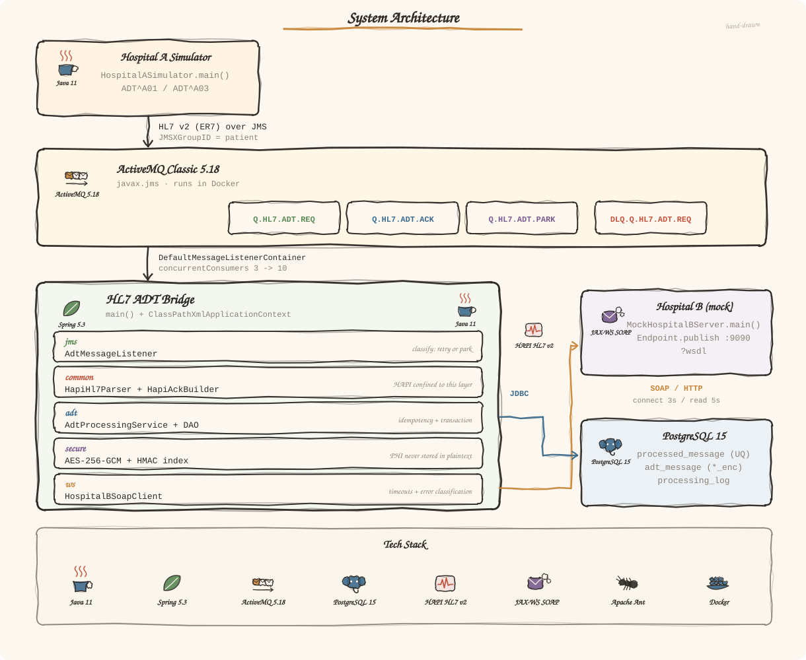
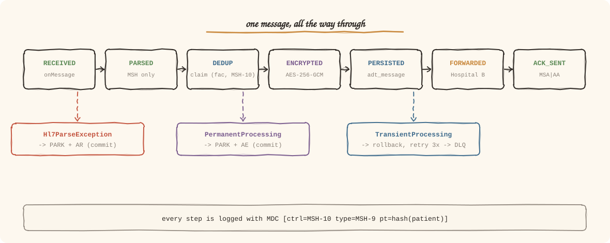

<div align="center">


**A hospital-to-hospital HL7 v2 ADT bridge — built the way legacy systems actually are.**

Apache Ant · Spring XML · ActiveMQ Classic · no WAS, just `main()`

[](#tech-stack)
[-5C8A56?style=flat-square)](#tech-stack)
[](#tech-stack)
[](#tech-stack)
[](#testing)

**English** · [한국어](README.ko.md)

</div>

---

## Table of Contents

1. [Why this exists](#why-this-exists)
2. [Architecture](#architecture)
3. [How one message flows](#how-one-message-flows)
4. [Tech stack](#tech-stack)
5. [Quick start](#quick-start)
6. [Project structure](#project-structure)
7. [Design decisions](#design-decisions)
8. [Bugs this PoC actually caught](#bugs-this-poc-actually-caught)
9. [Testing](#testing)
10. [Mapping to `condb-secure`](#mapping-to-condb-secure)
11. [Documentation](#documentation)

---

## Why this exists

I'm reverse-engineering a legacy in-house module at work called `condb-secure`:
Apache Ant build, Spring XML configuration, no application server — it boots from
`main()` with a `ClassPathXmlApplicationContext`, consumes an ActiveMQ queue, encrypts,
persists, calls an external SOAP service, and publishes a response.

Reading that code taught me the *shape* of the system. It did not teach me **why each
decision was made**. So I rebuilt the same architecture in a domain I don't know —
**hospital HL7 v2 messaging** — and made every decision on purpose.

The constraint is deliberate: **no Spring Boot, no annotations, no auto-configuration.**
Everything that Boot would hide is written out by hand, because the point is to see it.

> ⚠️ **All patient data in this repository is synthetic.** No real patient information is
> used anywhere — not in samples, tests, documentation, or logs.

---

## Architecture

Hospital A emits admission/discharge (ADT) events as HL7 v2 messages. This bridge
consumes them, encrypts the patient identifiers, stores them, forwards them to Hospital B
over SOAP, and answers with an HL7 ACK.

<div align="center">

</div>

Three processes, each with its own `main()`:

| Process | Command | Role |
|---|---|---|
| **Bridge** | `ant run-bridge` | The module itself — listener, services, DAOs |
| **Hospital B (mock)** | `ant run-mock` | JAX-WS endpoint the bridge calls |
| **Hospital A (simulator)** | `ant run-simulator` | Publishes ADT messages into the queue |

---

## How one message flows

<div align="center">

</div>

The listener's only job is **classifying failures**: retry, or park and commit.

| Exception | ACK | Retried? | What happens |
|---|---|---|---|
| `Hl7ParseException` | `AR` | ✗ | Parked, transaction **commits** |
| `PermanentProcessingException` | `AE` | ✗ | Parked, transaction **commits** |
| `TransientProcessingException` | *(none)* | ✓ | **Rollback** → 2s/4s/8s → DLQ |
| any other `RuntimeException` | *(none)* | ✓ | Rollback — likely a bug, don't hide it |

Sending no ACK on a transient failure is deliberate. Nothing is settled yet; an early
`AE` tells the sender the message failed *permanently*.

---

## Tech stack

<div align="center">
<table>
<tr>
<td align="center" width="120"><br><sub>Java 11</sub></td>
<td align="center" width="120"><br><sub>Spring 5.3 (XML)</sub></td>
<td align="center" width="120"><br><sub>ActiveMQ Classic 5.18</sub></td>
<td align="center" width="120"><br><sub>PostgreSQL 15</sub></td>
</tr>
<tr>
<td align="center"><br><sub>HAPI HL7 v2.5</sub></td>
<td align="center"><br><sub>JAX-WS 2.3</sub></td>
<td align="center"><br><sub>Apache Ant + Ivy</sub></td>
<td align="center"><br><sub>Docker Compose</sub></td>
</tr>
</table>
<sub>Icons are hand-drawn approximations, not official marks. Generated by <code>docs/images/generate.py</code>.</sub>
</div>

A few version choices that are not arbitrary:

- **ActiveMQ Classic 5.18** is the last line that uses the `javax.jms` namespace. 5.19+
  moves to `jakarta.jms`, which would break the legacy constraint.
- **logback 1.3.x, not 1.2.x.** `activemq-client` 5.18 is built against slf4j 2.0, so
  slf4j gets upgraded whether you declare it or not — and slf4j 2.0 + logback 1.2 binds
  to nothing and logs silently disappear. See [bug #2](#bugs-this-poc-actually-caught).
- **Ant + Ivy**, not plain Ant. Hand-managing 44 jars is not a learning exercise.

---

## Quick start

```bash
# Keys are injected from outside. The bridge refuses to start without them.
export HL7POC_PHI_KEY="$(openssl rand -base64 32)"
export HL7POC_BLIND_INDEX_KEY="$(openssl rand -base64 32)"

ant docker-up      # ActiveMQ + PostgreSQL
ant resolve        # dependencies (first run, ~1 min)
ant dist           # compile + build

# terminal 2
ant run-mock       # Hospital B mock SOAP server → :9090

# terminal 3
ant run-bridge     # the bridge

# terminal 4 — send something
ant run-simulator -Dargs="admit-discharge"
ant run-simulator -Dargs="ack 10"
```

ActiveMQ console: <http://localhost:8161/admin> (admin/admin) · PostgreSQL: `localhost:5432/hl7poc`

<details>
<summary><b>All Ant targets</b></summary>

| Target | What it does |
|---|---|
| `resolve` | Resolve dependencies into `lib/` (Ivy) |
| `compile` / `compile-test` | Compile (`-Dskip.resolve=true` to skip resolution) |
| `dist` | `dist/*.jar` + `dist/lib/` |
| `test` | Run tests (skips integration tests if Docker isn't up) |
| `run-bridge` | ① the bridge |
| `run-mock` | ② Hospital B mock SOAP server |
| `run-simulator` | ③ Hospital A simulator — `-Dargs="send a01 3"` |
| `run-dlq` | DLQ tooling — `-Dargs="list"`, `-Dargs="replay ALL"` |
| `docker-up` / `docker-down` / `docker-reset` / `docker-logs` | Local infrastructure |
| `clean` / `distclean` | Remove build output / dependencies too |

</details>

<details>
<summary><b>Simulator scenarios</b></summary>

```bash
ant run-simulator -Dargs="send a01 3"      # 3 admissions, fresh control IDs
ant run-simulator -Dargs="admit-discharge" # admit → discharge, same patient
ant run-simulator -Dargs="duplicate"       # same control ID twice (idempotency)
ant run-simulator -Dargs="burst 30"        # 30 messages across 5 patients
ant run-simulator -Dargs="file adt_a01_broken_msh.hl7"   # error case
ant run-simulator -Dargs="ack 15"          # print incoming ACKs
```

</details>

---

## Project structure

```
com.example.hl7poc
├── Main.java                  main() + ClassPathXmlApplicationContext
├── common/   hl7/  parser, ACK builder, HL7 date handling   ← HAPI stays here
│             dto/  AdtEvent, PatientInfo (toString always masks)
│             exception/  retry policy encoded in the type hierarchy
│             util/  masking, MDC trace context
├── jms/      listener/ publisher/ dlq/ support/
├── adt/      service/ dao/ domain/
├── secure/   AES-256-GCM, HMAC blind index, key providers
├── ws/       SOAP client + mock endpoint + shared SEI
└── simulator/

src/main/resources/
├── spring/   app-context.xml + 8 feature files
├── config/   hl7poc.properties   (every value is ${ENV:default})
├── hl7-samples/   8 messages: 3 valid, 5 error cases
└── wsdl/     hospital-b-admission.wsdl
```

---

## Design decisions

<details open>
<summary><b>Idempotency — the claim is inside the transaction</b></summary>

The uniqueness key is `(sending_facility, msg_control_id)`, not MSH-10 alone: a control
ID is only unique *within a sending system*, so a single-column key breaks the moment a
second hospital connects.

The claim row is inserted **first**, before encryption, persistence and the SOAP call —
because processing a duplicate would send Hospital B a second admission notice and corrupt
*their* data.

Crucially the claim is **inside the same transaction**. If the SOAP call fails, the claim
rolls back with everything else, so the retry is treated as a first delivery. Had the
claim been committed separately, the retry would be judged "already processed" and the
admission record would vanish silently — the worst failure mode in healthcare integration.

Duplicate detection uses the affected-row count of `INSERT ... ON CONFLICT DO NOTHING`.
A `SELECT`-then-`INSERT` check lets two concurrent consumers both see "not present".
</details>

<details>
<summary><b>Transactions — best-effort 1PC, DB first</b></summary>

SOAP isn't a transactional resource, so XA buys no real atomicity. The listener container
opens a DB transaction, and the JMS session commits *after* it. Die in between and the
message is redelivered — idempotency absorbs it. The reverse order loses messages.

ACK publishing is synchronized to the **DB transaction** (not to the consumer's JMS
session) via `TransactionAwareConnectionFactoryProxy` — so a rollback takes the ACK with
it. [Details](docs/03-spring-xml.md)
</details>

<details>
<summary><b>Concurrency — message groups, plus a DB backstop</b></summary>

`concurrentConsumers` 3 → 10, with `JMSXGroupID` per patient so one patient's events pin
to one consumer. Measured reality: **groups get reassigned even when no consumer dies** —
scaling from 3 to 8 consumers moved 3 of 5 patient groups across threads. Ordering held,
but "usually holds" isn't something to stake clinical data on, so the service also flags
events older than the latest stored one.
</details>

<details>
<summary><b>Security — keys outside the code, masking by type</b></summary>

Ciphertext format is `v1:{keyId}:{iv}:{ct}`. Without the version you can't change
algorithms without re-encrypting everything; without the keyId, **key rotation means data
loss**. The prefix is bound as AAD so a swapped keyId is detected.

Patient IDs get an **HMAC** blind index, not a plain SHA-256 — the value space of a patient
number is small enough to enumerate. It uses a *different* key from encryption.

Missing keys fail at context load, not on the first patient message. `PatientInfo.toString()`
masks unconditionally, because `log.info("patient={}", patient)` is how leaks happen.
</details>

<details>
<summary><b>Observability — one MSH-10, end to end</b></summary>

```
2026-09-15 12:46:11.787 INFO [container-3] [ctrl=SIM...0001 type=ADT^A01 pt=35c8aac3]
  STEP=FORWARDED Hospital B accepted. receiptId=HOSPB-000001 elapsed=348ms
```

`STEP=` markers (`RECEIVED → PARSED → DEDUP_OK → ENCRYPTED → PERSISTED → FORWARDED →
ACK_SENT`) land in both the log file and the `processing_log` table, so "where did this
message get to?" is answerable with one SQL query.
</details>

---

## Bugs this PoC actually caught

The point of building it rather than reading it. Each of these was found by measuring,
not by reasoning.

| # | Symptom | Root cause | Caught by |
|---|---|---|---|
| 1 | Retries fired **0.03s apart** instead of 2s/4s/8s | An external transaction manager makes `DMLC` pick `CACHE_NONE`, which discards the consumer each receive — and client-side redelivery delay works by *pausing that consumer*. Retry counts and DLQ routing looked perfectly normal. | Printing delivery timestamps ([#3.2](docs/03-spring-xml.md)) |
| 2 | Logging would have **silently vanished** in production | `activemq-client` 5.18 is built against slf4j 2.0, so 1.7 gets upgraded during resolution. slf4j 2.0 + logback 1.2 binds to nothing and falls back to a no-op logger. Builds and runs fine. | Inspecting resolved jars ([#4.2](docs/02-infrastructure.md)) |
| 3 | An **empty message body** was retried 4× into the DLQ | Body extraction sat outside the parse-failure `catch`. An empty body is empty no matter how often you resend it. | A unit test ([#2](docs/05-listener-service-dao-secure.md)) |
| 4 | Park + ACK **swallowed**; message went to DLQ anyway | Throwing `PermanentProcessingException` marks the participating transaction rollback-only, so the listener's park and ACK writes were discarded at commit — for an error explicitly classified as *do not retry*. | End-to-end test ([#3](docs/07-ack-retry-dlq.md)) |
| 5 | **Patient data leaked into ACKs** sent to the other hospital | Our exceptions never embed the raw message — but HAPI's parse exception appends "the first 50 chars of the message for reference", and that text was relayed into `ERR-8`. | Reading ACK output by eye ([#4](docs/08-simulator-scenarios.md)) |

Bugs 1, 2 and 5 are the interesting ones: **every other signal looked healthy.**

---

## Testing

```bash
ant docker-up && ant test     # 112 tests
```

Integration tests skip themselves (`Assume`) when the infrastructure isn't running, so
`ant test` passes without Docker too.

| Suite | Tests | Covers |
|---|---|---|
| `BridgeEndToEndTest` | 12 | The whole `app-context.xml`, real broker + DB + SOAP |
| `HapiHl7ParserTest` | 11 | Parsing, mapping, CR/LF/CRLF, MLLP framing, error classification |
| `HapiAckBuilderTest` | 15 | ACK structure, error-code mapping, PHI containment |
| `AdtProcessingServiceTest` | 10 | Idempotency, rollback, blind index, PHI at rest |
| `AesGcmPhiCipherTest` | 12 | Round-trip, IV uniqueness, tampering, key rotation |
| `AdtMessageListenerTest` | 11 | Failure classification, MDC hygiene |
| `SpringWiringTest` | 5 | Transaction boundaries, retry backoff, DLQ routing |
| `HospitalBSoapClientTest` | 13 | Timeouts, fault handling, thread safety |
| `HmacBlindIndexTest` / `Hl7DatesTest` / `MaskingUtilsTest` | 23 | Determinism, partial dates, masking rules |

Several tests exist specifically to stop a fix from silently regressing — the redelivery
backoff test fails with `gap[0]=23ms` if `cacheLevel` ever drifts back.

---

## Mapping to `condb-secure`

| `condb-secure` | this PoC | What changed |
|---|---|---|
| `jms` (PNR request/response) | `jms` (ADT request / ACK / park / DLQ) | The response is a **specified format** (HL7 ACK), not free-form |
| `condb` (business + DB) | `adt` (ADT processing + DAO) | Business key is **MSH-10**, not a PNR |
| `secure` (crypto) | `secure` (PHI crypto + key management) | Adds a searchable blind index |
| `ws` (GDS SOAP) | `ws` (Hospital B SOAP + mock) | The mock lives in the repo, so failure paths are testable |
| `common` | `common` (HL7 wrapper, DTOs, exceptions) | Retry policy is encoded in the exception hierarchy |

Structurally identical: Ant build, Spring XML with `<import>`, `DefaultMessageListenerContainer`,
`JmsTemplate` responses, DLQ on exhausted retries, and a standalone `main()` with no WAS.

---

## Documentation

Build notes for each step. **Written in Korean** — they're a working log, not a manual.

| Step | Document |
|---|---|
| 1 | [Architecture & package structure](docs/01-architecture.md) |
| 2 | [Docker Compose & the Ant build](docs/02-infrastructure.md) |
| 3 | [Spring XML & transaction boundaries](docs/03-spring-xml.md) |
| 4 | [HL7 samples & the parser wrapper](docs/04-hl7-parser.md) |
| 5 | [Listener, service, DAO, crypto](docs/05-listener-service-dao-secure.md) |
| 6 | [Hospital B SOAP integration](docs/06-soap-integration.md) |
| 7 | [ACK, retry, DLQ](docs/07-ack-retry-dlq.md) |
| 8 | [Simulator & integration scenarios](docs/08-simulator-scenarios.md) |

---

<div align="center">
<sub>

A learning PoC — **not production software**. It runs over plain HTTP, ships a local-only
default DB password, and its threat model is "a laptop". Real deployments need TLS with
mutual authentication, a managed key store, and an actual security review.

All patient data is synthetic.

</sub>
</div>
